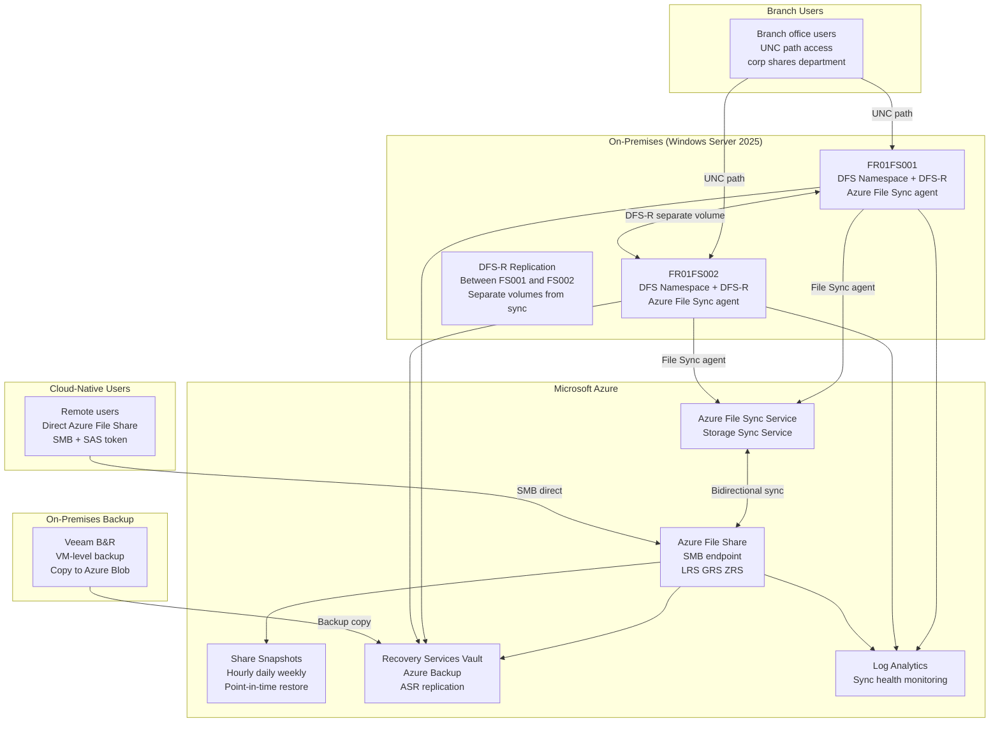

# Secure Hybrid File Services Architecture (DFS + Azure File Sync)

[](https://sergeksfumey.com/projects/secure-hybrid-file-services-architecture)
[]()
[]()
[]()

> **Design Study** -- Independent architecture exercise for distributed enterprise environments. Not associated with a production deployment.

Hybrid file services platform integrating Windows Server 2025 DFS namespace infrastructure with Azure File Sync, Azure File Shares, snapshot versioning, Azure Backup, and Azure Site Recovery -- delivering low-latency branch access with centralised cloud-backed governance across distributed environments.

---

## Architecture Diagram



---

## Recovery Objectives

| Failure Scenario | RTO | RPO | Recovery Mechanism |
|---|---|---|---|
| Individual file/folder deletion | Minutes | Point-in-time | Azure File Share snapshot restore |
| File server VM failure | 2 hours | 4 hours | Azure Site Recovery failover |
| Branch site loss | 4 hours | 4 hours | Cloud-native Azure File Share access |
| Azure File Share corruption | 1 hour | 24 hours | Azure Backup restore |
| Full DR scenario | 8 hours | 24 hours | ASR + Azure Backup combined |

---

## Executive Summary

Architected a hybrid enterprise file services platform integrating Windows DFS namespace infrastructure with Azure File Sync, Azure File Shares, and cloud-native backup and DR -- delivering low-latency branch office access, centralised cloud-backed storage governance, resilient synchronisation, and scalable data protection across distributed environments.

The architecture modernises traditional DFS-only infrastructure by combining local file caching performance with Azure File Sync hybrid synchronisation, cloud tiering for storage optimisation, snapshot-based versioning, and layered backup and DR -- enabling incremental cloud adoption without replacing existing DFS infrastructure or disrupting established operational workflows.

---

## Architecture Principles

- Hybrid-first modernisation -- extend cloud capabilities into existing DFS infrastructure rather than replacing it
- Local performance with centralised scalability -- branch caching preserves LAN-speed access while Azure provides unlimited storage backend
- Incremental cloud adoption -- gradual synchronisation-based migration path avoiding disruptive cutover
- Unified namespace abstraction -- DFS namespace preserves existing UNC paths regardless of backend storage location
- Layered resilience -- snapshots, backup, and DR provide independent recovery mechanisms at different time horizons
- Separation of sync, backup, and DR -- independent layers with separate failure modes and recovery paths
- Centralised observability -- sync health, storage utilisation, and backup status unified in Azure Monitor
- Operational continuity -- architecture evolves existing infrastructure rather than replacing it

---

## Architecture Layers

### 1. On-Premises File Services Layer

Windows Server 2025 DFS services providing distributed low-latency file access:

DFS Namespace:
- Unified logical access layer: single namespace (\\corp\shares) regardless of physical server
- Transparent access: users unaware of backend server locations
- Namespace abstraction: backend changes without UNC path reconfiguration

DFS Replication (DFS-R):
- Bidirectional replication between FR01FS001 and FR01FS002
- Scheduled bandwidth throttling -- prevents WAN saturation during business hours
- Local caching: branch users read from local storage at LAN speed

Critical constraint: DFS-R and Azure File Sync must operate on SEPARATE volumes on each server. Microsoft does not support running DFS-R and Azure File Sync on the same volume -- this causes data consistency issues.

Azure File Sync agent on each DFS server:
- Each server registered as server endpoint in sync group
- Synchronises configured share path to Azure File Share cloud endpoint
- Cloud tiering: stubs replace tiered files, transparent recall on access

### 2. Cloud Storage Layer

Azure File Share:
- Central synchronisation endpoint for all sync groups
- SMB protocol: on-premises DFS sync and direct cloud-native access
- Scalable capacity without on-premises hardware constraints
- Redundancy options: LRS (default), ZRS (zone resilient), GRS (geo-redundant)

Cloud Tiering Policies:

| Policy | Behaviour | Use Case |
|---|---|---|
| Volume Free Space | Tiers files to maintain minimum free space % | General storage constraint |
| Date Policy | Tiers files not accessed within N days | Compliance archival, cold data |

Sync Conflict Resolution:
- Conflict: same file modified on multiple endpoints before sync completes
- Resolution: most recent version retains original filename
- Conflicting version: renamed with conflict suffix + originating server name
- Both versions retained -- admin resolves via File Sync conflict report

### 3. Access Model Layer

Branch User Access (DFS path):
- Existing UNC paths: \\corp\shares\department
- Local DFS server: LAN-speed access from cached/local content
- No user workflow changes: mapped drives and app integrations unchanged

Cloud-Native User Access (direct Azure File Share):
- Remote/cloud-only users: direct SMB access to Azure File Share
- Azure AD authentication: identity-driven access governance
- Storage account firewall: authorised network ranges + private endpoints
- SAS token: scoped programmatic access for app integrations

### 4. Backup and DR Layer

Azure File Share Snapshots:
- Hourly snapshots for recent operational recovery
- Daily and weekly for longer retention
- Fast individual file/folder recovery without full backup restore
- Retention aligned to RPO targets

Azure Backup:
- File Share protection via Recovery Services Vault
- Independent backup copies if snapshot data corrupted/deleted
- Scheduled policy with defined retention beyond snapshot windows

Azure Site Recovery:
- Continuous replication of DFS server VMs to Azure
- Recovery plans for coordinated DFS VM failover
- Test failover: DR validation without production impact

Veeam Backup and Replication:
- VM-level application-consistent backup for DFS servers
- DFS namespace database and DFS-R state captured correctly
- Backup copy jobs to Azure Blob Storage (immutable retention)

### 5. Security Layer

Identity-driven access controls:
- NTFS permissions on on-premises DFS shares (preserved through File Sync)
- Azure AD integration for cloud-native Azure File Share access
- Azure RBAC for management plane access (prevent unauthorised config changes)

Network access governance:
- Storage account firewall: authorised IP ranges + private endpoints
- VPN Gateway: secure hybrid connectivity for File Sync agent communication
- Private endpoint option: eliminates public internet exposure (requires DNS conditional forwarder config for on-premises resolution)

SAS Token access:
- Time-limited tokens for programmatic app integrations
- Scoped permissions: read-only, read-write, or list-only
- Token expiry: prevents long-lived credential exposure

### 6. Monitoring Layer

Azure Monitor and Storage Insights:
- Real-time Azure File Share utilisation, transactions, latency
- Azure File Sync health: sync status, pending files, errors, tiering efficiency
- Alert rules: sync failures, capacity thresholds, backup policy compliance

Key monitoring scenarios:
- Sync session health: files stuck in queue, persistent sync errors
- Cloud tiering efficiency: tiered volume and recall frequency
- Backup compliance: scheduled backups completing, retention enforced
- Conflict report: file conflicts requiring admin resolution

---

## Design Decisions

### ADR-001 -- Hybrid DFS + Azure File Sync over Cloud-Only Storage
**Decision:** Preserve DFS local caching, extend with Azure File Sync
**Rationale:** Cloud-only Azure Files cannot deliver LAN-speed performance for branch users with large file workloads or legacy apps. Hybrid model preserves performance while enabling cloud-backed governance.
**Trade-off:** Two-platform operational complexity. Mitigated through Azure File Sync automated sync and centralised Azure Monitor.

### ADR-002 -- DFS Namespace as Abstraction Layer
**Decision:** DFS namespace preserved as user-facing access layer
**Rationale:** Namespace abstracts backend changes from users -- enables incremental modernisation (server migrations, Azure File Sync, cloud-only transition) without UNC path reconfiguration.
**Trade-off:** DFS namespace service dependency. Mitigated through two DFS servers with ASR failover capability.

### ADR-003 -- Separate Volumes for DFS-R and Azure File Sync
**Decision:** DFS-R and Azure File Sync operate on separate volumes per server
**Rationale:** Microsoft explicitly does not support DFS-R and Azure File Sync on the same volume -- data consistency issues result. Architectural separation is mandatory.
**Trade-off:** Additional storage volume planning complexity per server.

### ADR-004 -- Snapshot-Based Versioning for Operational Recovery
**Decision:** Share snapshots as primary individual file recovery mechanism
**Rationale:** Full backup restore for individual file recovery is disproportionately slow. Snapshots provide near-instant point-in-time recovery -- addressing majority of operational scenarios in minutes vs hours.
**Trade-off:** Snapshot retention consumes storage quota. Retention policy must balance recovery granularity against storage cost.

### ADR-005 -- Separation of Sync, Backup, and DR
**Decision:** Azure File Sync, Azure Backup, and ASR as independent layers
**Rationale:** Combined sync + backup + DR creates common failure mode -- File Sync disruption would eliminate recovery capability. Independent layers ensure recovery capability survives any single mechanism failure.
**Trade-off:** Operational complexity of three independent backup/DR mechanisms. Justified by independent trust boundary resilience.

### ADR-006 -- Cloud Tiering for Storage Optimisation
**Decision:** Enable cloud tiering on all Azure File Sync server endpoints
**Rationale:** On-premises storage growth without tiering requires continuous hardware investment. Cloud tiering automatically manages cold data migration to Azure without user workflow disruption.
**Trade-off:** Recall latency on first access for tiered files. Mitigated through tiering policy calibration based on actual access patterns from File Sync health metrics.

---

## Technologies

| Category | Technologies |
|---|---|
| File Services | Windows Server 2025 · DFS Namespace · DFS Replication (DFS-R) |
| Hybrid Synchronisation | Azure File Sync · Azure File Share |
| Connectivity | Azure VPN Gateway · Private Endpoints |
| Backup and DR | Azure Backup · Azure Site Recovery · Veeam B&R |
| Security | Azure RBAC · NTFS Permissions · SAS Tokens · Storage Account Firewall |
| Monitoring | Azure Monitor · Log Analytics · Azure Storage Insights |

---

## Compliance Mapping

| Control | Framework | Implementation |
|---|---|---|
| Data backup | CIS Control 11 | Azure Backup + Veeam + snapshots |
| Offsite backup | CIS Control 11.3 | Azure Backup vault + Veeam Azure Blob copy |
| Access control | CIS Control 6 | NTFS permissions + Azure RBAC + firewall |
| Audit logging | CIS Control 8 | Log Analytics + storage diagnostics |
| Recovery testing | NIST 800-34 | ASR test failover + snapshot restore validation |
| Data protection | GDPR Art. 32 | Encryption at rest + in transit + access governance |
| Incident response | NIST 800-61 | DR runbook + ASR recovery plans |

---

## Repository Structure
```
hybrid-file-services-dfs/
├── terraform/
│   ├── modules/
│   │   ├── storage-sync/
│   │   ├── file-share/
│   │   └── backup-vault/
│   └── environments/
│       └── prod/
├── scripts/
│   ├── Configure-DFSNamespace.ps1
│   ├── Install-FileSyncAgent.ps1
│   ├── New-SASToken.ps1
│   └── Get-FileSyncHealthReport.ps1
├── runbooks/
│   ├── Invoke-FileSyncDRTest.ps1
│   └── Resolve-FileSyncConflicts.ps1
├── kql/
│   ├── file-sync-health.kql
│   └── storage-performance.kql
├── docs/
│   ├── architecture.md
│   ├── dfs-design-guide.md
│   └── tiering-operations.md
└── pipelines/
    └── azure-pipelines.yml
```
---

## Key Trade-offs

| Decision | Benefit | Trade-off |
|---|---|---|
| Hybrid DFS + File Sync | LAN performance + cloud governance | Two-platform operational complexity |
| Separate DFS-R and File Sync volumes | Data consistency (Microsoft requirement) | Additional storage volume planning |
| Cloud tiering enabled | Reduced on-premises storage growth | Recall latency for cold files |
| Snapshot versioning | Near-instant operational file recovery | Storage quota consumption |
| Independent sync/backup/DR | No common failure mode | Three mechanisms to manage |
| Private endpoint | No public internet exposure | DNS conditional forwarder required |

---

## Future Evolution

- SMB over QUIC: secure branch file access over internet without VPN
- Zero Trust storage access via Azure Private Endpoints + Conditional Access
- Advanced lifecycle management: auto-archival to Azure Blob cool/archive tiers
- Cross-region Azure File Share replication for geographic resilience
- Terraform IaC automation for repeatable hybrid file services deployment
- Microsoft Purview integration for data classification and compliance labelling

---

*Part of the [sergeksfumey](https://github.com/sergeksfumey) infrastructure architecture portfolio · [sergeksfumey.com](https://sergeksfumey.com)*
